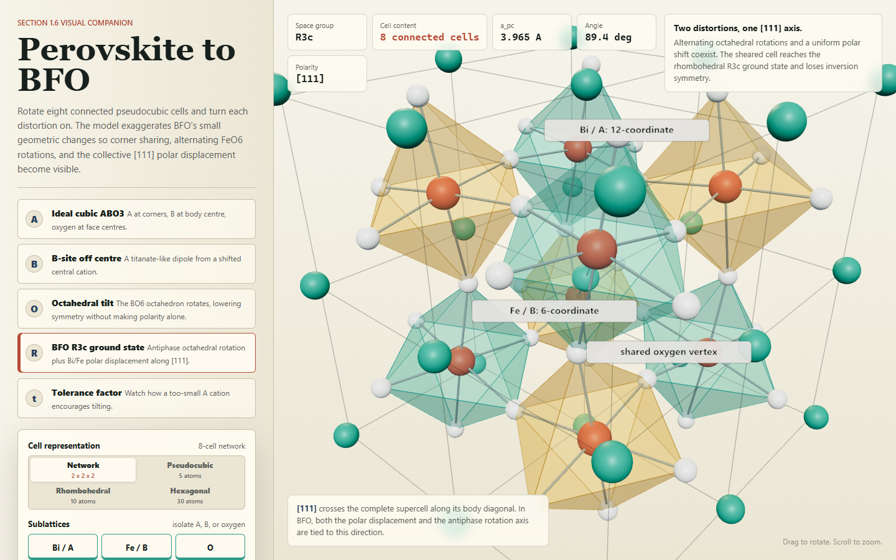
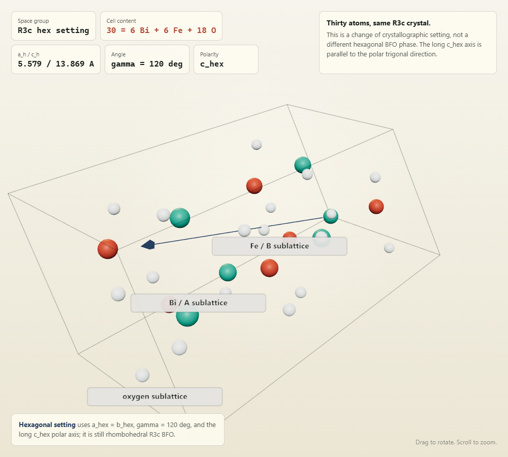
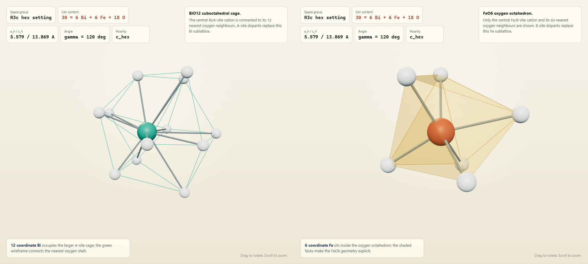

# Perovskite and BFO Visualizer

I built this visual companion because the usual unit-cell diagrams make bismuth ferrite look simpler than it is. A single cube is enough to name the A, B, and oxygen sites, but it does not make the corner-sharing network, opposite octahedral rotations, or collective `[111]` displacement easy to see.

**[Open the interactive visualizer](https://hasnain7abbas.github.io/perovskite-bfo-visualizer/)**



The default scene is a `2 x 2 x 2` block of eight connected pseudocubic cells. Gold and teal distinguish the two antiphase FeO6 rotation senses. The distortion is deliberately exaggerated so the structural change can be read without measuring the screen.

## Cell Settings

The same BFO structure is useful in three different crystallographic descriptions:

| View | Cell content | Best used for |
| --- | --- | --- |
| Pseudocubic reference | `5 atoms = 1 Bi + 1 Fe + 3 O` | Naming perovskite sites, `a_pc`, and pseudocubic directions |
| Primitive rhombohedral `R3c` | `10 atoms = 2 Bi + 2 Fe + 6 O` | The smallest cell containing the complete antiphase tilt motif |
| Conventional hexagonal `R3c` setting | `30 atoms = 6 Bi + 6 Fe + 18 O` | Hexagonal axes, diffraction conventions, and the long polar `c_hex` axis |

The 5-atom view is a reference basis rather than a complete `R3c` repeat. The antiphase `a^-a^-a^-` rotation needs the 10-atom primitive cell. The 30-atom hexagonal setting is the same rhombohedral BFO crystal expressed with a larger conventional cell, not a separate hexagonal BFO phase.



## Coordination And Sublattices

Bi/A, Fe/B, and oxygen can be shown separately. This makes dopant-site discussions much less ambiguous: La, Gd, Sm, or Sr replace the Bi/A sublattice, while Mn, Co, or Cr replace the Fe/B sublattice.

The coordination controls strip the structure down further. `BiO12` shows one bismuth ion with its twelve nearest oxygen neighbours; `FeO6` shows only the iron-centred oxygen octahedron.



## What To Explore

- Start with ideal `Pm3m` and identify the A corner, B body-centre, and oxygen face-centre sites.
- Switch to octahedral tilt and follow one shared oxygen between oppositely rotating octahedra.
- Open BFO `R3c` and compare the antiphase rotation with the polar Bi/Fe shift along `[111]`.
- Move the tolerance factor away from `t = 1` and watch the packing-driven tilt change.
- Compare the 5-, 10-, and 30-atom settings without changing the underlying material.

The room-temperature reference values used in the display are approximately `a_pc = 3.965 A`, `a_hex = 5.578 A`, `c_hex = 13.868 A`, rhombohedral angle `89.4 deg` in the pseudocubic description, and a Bi displacement of about `0.6 A` along `[111]`.

## Run Locally

The Three.js files are included in the repository, so the visualizer does not need a CDN after checkout.

```powershell
python -m http.server 8765 --bind 127.0.0.1 --directory outputs
```

Open `http://127.0.0.1:8765/perovskite-bfo-visualizer.html`.

## Release

- [Latest GitHub release](https://github.com/hasnain7abbas/perovskite-bfo-visualizer/releases/latest)
- [Launch the visualizer](https://hasnain7abbas.github.io/perovskite-bfo-visualizer/)

The release is the hosted teaching tool; there is no installer or build step for visitors.

## Structure Sources

- [Palai et al., Physical Review B 77, 014110 (2008)](https://doi.org/10.1103/PhysRevB.77.014110)
- [Moreau et al., Journal of Physics and Chemistry of Solids 32, 1315-1320 (1971)](https://doi.org/10.1016/S0022-3697(71)80189-0)
- [Young et al., Physical Review Letters 109, 236601 (2012)](https://doi.org/10.1103/PhysRevLett.109.236601)

The automated browser check covers desktop and mobile rendering, all three crystallographic atom counts, BiO12 and FeO6 neighbour counts, sublattice visibility, distortion modes, and console errors.
